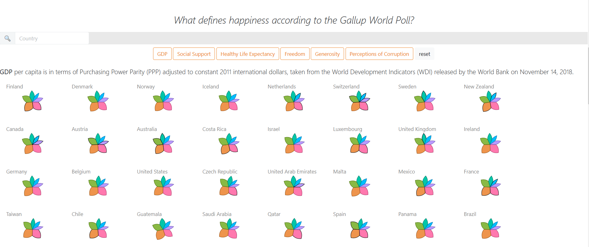

# World Happiness Report 2019
 
The d3.js visualisation is based on the World Happiness Data, freely available at: https://www.kaggle.com/unsdsn/world-happiness#2019.csv.  
The dataset reports the state of happiness in the world across 156 nations collected through the Gallup World Poll. 
 The most recent dataset from 2019 includes nine columns: The overall rank, country or region name, the happiness score, GDP per capita, social support, healthy life expectancy, freedom to make life choices, generosity, and the perception of corruption within the country.  
These factors can be assessed in relation to the happiness score and overall ranking of countries to estimate and explore the extent to which each factor contributes individually or collaboratively on the life evaluation score across the different countries. The attributes GDP per Capita, Family, Life Expectancy, Freedom, Generosity, and Trust in Government/Perception of Corruption compose the happiness scale and are numerically represented on their extent to which each factor contributes in affecting the happiness within the country. Thus, the higher a score of an attribute, the higher its contribution to the happiness score. All factors added up will provide the given happiness score.
 
The visual analysis has been focused on providing the opportunity to explore patterns or attributes which underlie the computed score of happiness with an attempt to put the given numbers into a broader perspective and an overall context: What defines happiness according to the Gallup World Poll?
 
I have integrated a choropleth map to provide an overview on the countries available. Colour saturation has been adapted to include an overview on the distribution and scale of the reported happiness scores. As significant ranking differences can be observed with just 1 point of difference, I have chosen the distributed colour scale to clarify differences in ranking or happiness to the viewer. A tooltip has been adapted to extract country name and scores.

Each country is displayed as a flower chart composed of six petals which represent the attributes on which the happiness score is based on. The petal size has been adapted to the contribution score given. When overlooking the flowers once can firstly perceive the dominant attributes based on the colour and size. In this case, particularly the orange petal or social support seems to be a prevalent factor in most countries. While generosity (blue petal) appears to be less impactful to happiness reported. When hovering on a petal, one can retrieve the exact scores and attribute names. 

The petals are organised by ranking, incrementing from the left to right and from the top to the bottom. The ranking number can be retrieved when hovering over the flower. This is particularly useful when using the search bar to retrieve specific countries. The search bar facilitates the comparison of flowers by reducing the number of visual variables while they can still be put into context based on the tooltip information. 

In my visualisation I hope to illustrate that high- and low-ranking countries present similar flower shapes despite the big differences in their happiness ranking. Thus, indicating that the definition of happiness in countries may go beyond the six attributes given. 